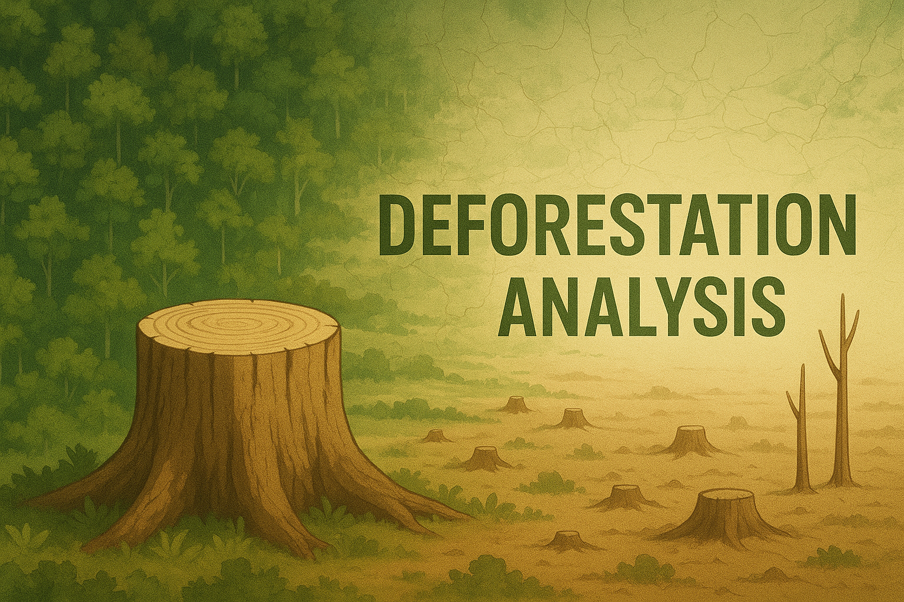
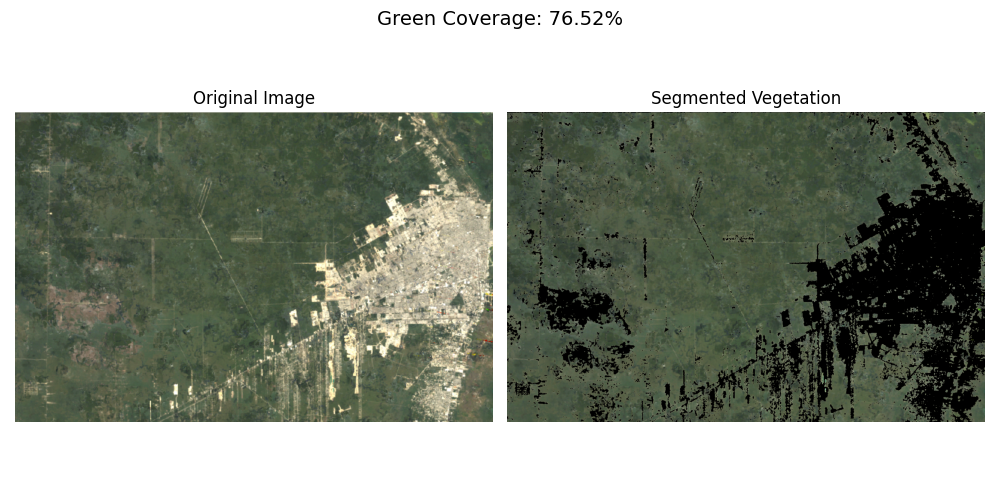
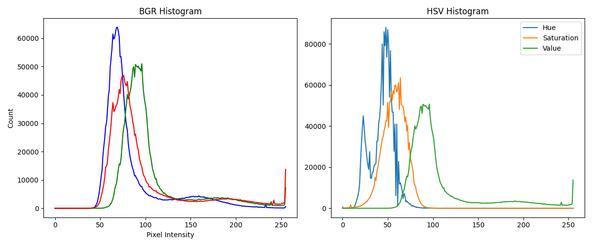

# Deforestation Analysis using Color Segmentation



[](https://www.python.org/)
[](https://opencv.org/)
[](https://matplotlib.org/)

---

## 🏞 Overview

Deforestation Analysis is a simple computer vision project that uses **color segmentation** to analyze vegetation cover in satellite or aerial images.  
It highlights green areas, calculates the percentage of vegetation coverage, and visualizes pixel distribution using **BGR and HSV histograms**.  
This tool is ideal for tracking deforestation trends or comparing forest cover across different time periods.  
By automating segmentation and analysis, it provides an easy way to visualize environmental changes over time.

---

## ✨ Features

- **Vegetation Segmentation**: Detects green regions using HSV color thresholds.
- **Green Coverage Calculation**: Computes % of vegetation pixels.
- **Histogram Analysis**: Plots BGR and HSV histograms for vegetation trends.
- **Automated Output Saving**: Saves segmented results and histograms in `output/`.
- **Visual Comparison**: Displays original vs segmented images side-by-side.

---

## 📂 Folder Structure

```Structure
deforestation-analysis/
│
├── deforestation_analysis.py          # Main script
│
├── utils/
│   ├── color_utils.py                 # Segmentation + green coverage
│   └── visualization_utils.py         # Histograms + visualization
│
├── input/                             # Input images for analysis
│   ├── 1985.png
│   ├── 1993.png
│   ├── 2001.png
│   └── 2011.png
│
├── output/                            # Results auto-saved here
│   ├── 1985_segmented.png
│   ├── 1985_histogram.png
│   ├── 1993_segmented.png
│   ├── 1993_histogram.png
│   └── ...
│
├── assets/                            # For README visuals
│   ├── banner.png
│   ├── sample_segmented.png
│   └── sample_histogram.png
│
├── requirements.txt
├── .gitignore
├── LICENSE
└── README.md
```

---

## 🖼 Visual Outputs

### 🌳 Segmentation Example



### 📊 Histogram Example



---

## 🚀 How It Works

1. Place your forest or aerial images into the `input/` folder.
2. Run the script to process all images.
3. View results in the console and check `output/` for segmented vegetation maps and histograms.

---

## 📦 Requirements

This project requires the following Python libraries:

- **opencv-python** – For image processing and color segmentation.
- **numpy** – For numerical operations and pixel calculations.
- **matplotlib** – For plotting histograms and displaying results.

---

## 🔧 Installation

```bash
git clone https://github.com/HeleenaRobert/deforestation-analysis.git
cd deforestation-analysis
pip install -r requirements.txt
```

---

## ▶️ Usage

```bash
python deforestation_analysis.py
```

Results will be displayed on-screen and saved automatically in the `output/` folder.

---

## 🛠 Technologies Used

- [Python 3.8+](https://www.python.org/)
- [OpenCV](https://opencv.org/)
- [NumPy](https://numpy.org/)
- [Matplotlib](https://matplotlib.org/)

---

## 📝 License

This project is licensed under the [MIT License](LICENSE).

---

## 👩‍💻 Author

**Heleena Robert**  
[GitHub](https://github.com/HeleenaRobert)
